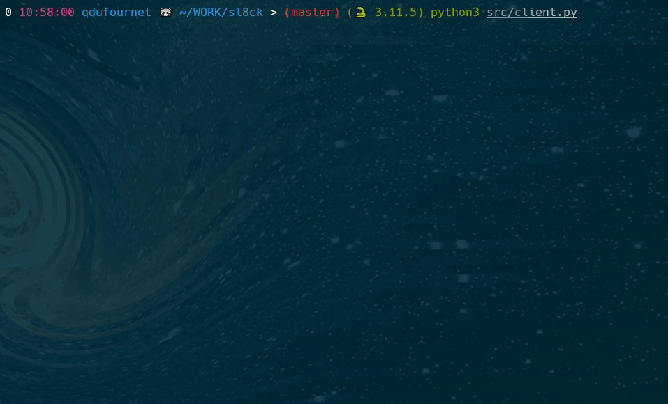

# Sl8ck
Sl8ck is a terminal based application to chat with your friends.

## Installation
### Python
```bash
git clone https://github.com/MCXIV/sl8ck.git
cd sl8ck
python3 -m pip install -r requirements.txt
```

### Encryption
Sl8ck uses fernet encryption to encrypt messages. Generate a key, and store is as an environment variable. Give it to your friend(s) so that they can decrypt your messages.

You can generate a key in python interpreter using the following commands:

```python
from cryptography.fernet import Fernet
key = Fernet.generate_key().decode()
print(key)
```

```bash
export SL8CK_KEY=<key>
```

## Usage

```bash
usage: client.py [-h] [-u URL] [-k KEY] [-r ROOM]

Client for sl8ck

options:
  -h, --help            show this help message and exit
  -u URL, --url URL     URL of the server
  -k KEY, --key KEY     Key to encrypt/decrypt messages
  -r ROOM, --room ROOM  Room to join

# To start the server
python3 src/server.py # By default, url is http://localhost:5000

# To start the client
python3 src/client.py --url <url> # By default, url is http://localhost:5000

# To join a room
python3 src/client.py --url <url> --room <room_name> # Room name can be anything, your friend just need to join the same room

# You can also pass the fernet key as an argument if you'd like
python3 src/client.py --url <url> --key <my_key>

# So, if you want to join a room with your friend, you can do the following
python3 src/client.py --url my-best-url.com --room uwuroom --key fernet_key
```

### CLI
When joining a room, you can send messages to the room. You can also see the messages sent by other people in the room.

But you also have a few commands that you can use:
- `:help` : Display the help message
- `:exit` : Exit the room
- `:clear` : Clear the screen
- `:cr` : Clear and refresh the screen

## Important
Each room can only have 1 single fernet key.

So, if you want to join a room with your friend, you need to share the fernet key with them. Also, you can't join the room with another fernet key than the one that was used to create the room.

## Demo

