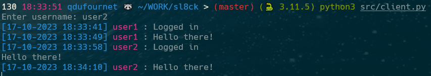

# Sl8ck
Sl8ck is a terminal based application to chat with your friends.

## Installation
### Python
```bash
git clone https://github.com/MCXIV/sl8ck.git
cd sl8ck
python3 -m pip install -r requirements.txt
```

### Encryption
Sl8ck uses fernet encryption to encrypt messages. Generate a key, and store is as an environment variable.

You can generate a key in python interpreter using the following commands:
```python
from cryptography.fernet import Fernet
key = Fernet.generate_key()
print(key)
```

```bash
export SL8CK_KEY=<key>
```

## Usage

```bash

# To start the server
python3 src/server.py # By default, url is http://localhost:5000

# To start the client
python3 src/client.py --url <url> # By default, url is http://localhost:5000
```

## Example
